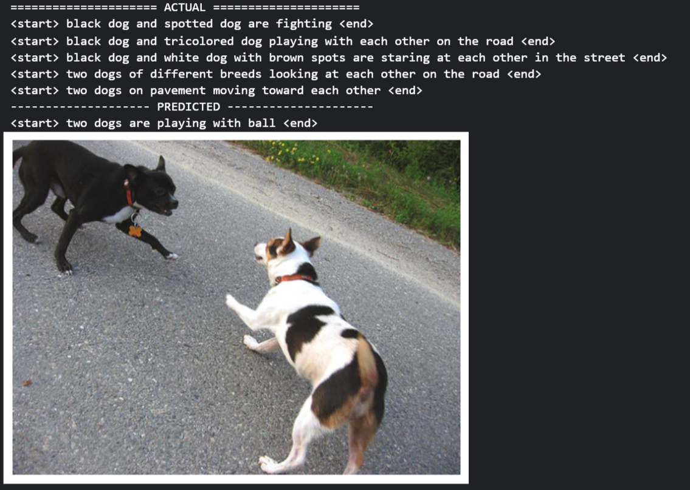

# Image Captioning with PyTorch

## Introduction
This repository implements an Image Captioning model using PyTorch. It combines feature extraction from images using ResNet-50 and sequence generation using an LSTM-based decoder. The model predicts captions for images, achieving competitive results on the Flickr8k dataset with limited computational resources.

This project is highly inspired by a tutorial from the [Hackers Realm YouTube channel](https://youtu.be/fUSTbGrL1tc?si=XW71Q1lOOz7Q8ue6), where a similar architecture was implemented using TensorFlow with a VGG backbone. In this implementation, we have adapted the model to PyTorch, using ResNet-50 as the backbone, and made several modifications to the training process and data loading pipeline. These enhancements resulted in a notable improvement in performance, increasing from [**BLEU-1 Score: 54.4** & **BLEU-2 Score: 31.0**](https://www.patreon.com/HackersRealm/shop/image-caption-generator-flickr8k-dataset-329024?utm_medium=clipboard_copy&utm_source=copyLink&utm_campaign=productshare_creator&utm_content=join_link)  to **BLEU-1 Score: 68.4** & **BLEU-2 Score: 53.3**.

**You can get this note book on Kaggle[https://www.kaggle.com/code/sohamumbare/image-captioning]**


## Features
- **ResNet-50 for Feature Extraction**: Pretrained ResNet-50 extracts image features for input to the captioning model.
- **LSTM-based Decoder**: The model leverages an LSTM network to generate captions from image features.
- **BLEU Score Evaluation**: Calculate BLEU scores to assess caption quality.
- **Modular Codebase**: Clear separation of dataset preprocessing, training, evaluation, and inference.

## Model Architecture

### Feature Extraction
- The ResNet-50 backbone is used to extract image features.
- The extracted feature vector serves as input to the decoder.

### Caption Generation
- The decoder is an LSTM-based network that takes the processed image features and generates a sequence of words on by one as caption.

### Training Pipeline
- The model is trained using Flickr8k dataset captions paired with image features.

## Dataset
The model is trained on the Flickr8k dataset, which contains only 8,000 images with multiple captions for each image. The dataset is very small compared to COCO but demonstrates good performance given limited resources.

## Installation

1. **Clone the repository**:
    ```bash
    git clone https://github.com/username/image-captioning-pytorch.git
    cd image-captioning-pytorch
    ```

2. **Install dependencies**:
    ```bash
    pip install -r requirements.txt
    ```

3. **Download the Flickr8k dataset**.

## Usage

### Training
To train the model, run:

```bash
python train.py
```

### Testing
Evaluate the model on the test dataset and calculate BLEU scores:

```bash
python test.py
```

### Generate Captions
Play with the model to generate captions for custom images by setting up the image_name correctly in the `evaluate.py`:

```bash
python evaluate.py
```


### Example Output
The script will:
- Print all groudtruth captions provided in the dataset for the image
- Print the predicted caption by the model.
- Display the image.


*For more results check `results` directory


## Results

After training on the **Flickr8k** dataset, the model achieved the following BLEU scores:

- **BLEU-1**: 68.4
- **BLEU-2**: 53.3

### Comparison with State-of-the-Art Models

| **Model**            | **BLEU-1** | **BLEU-2** | **Dataset**  |
|-----------------------|------------|------------|--------------|
| X-Transformer         | 80.9       | 65.8       | COCO         |
| Transformer_NSC       | 80.7       | 65.6       | COCO         |
| 🟢 **Our Model**       | **68.4**   | **53.3**   | **Flickr 8k** |


Although this model was trained on a relatively very small dataset (**Flickr8k**) with limited computational resources, it demonstrates promising performance.

## Directory Structure
```
image-captioning-pytorch/
│
├── colab/
│   └── imgcap.ipynb              # Jupyter Notebook [https://www.kaggle.com/code/sohamumbare/image-captioning]
│
├── data/
├── results/
│
├── src/                          # Source code for the project
│   ├── dataset/                  # Dataset utilitize
│   │   ├── caption.py            # Handles loading and processing captions
│   │   ├── dataset.py            # Dataset class for handling image-caption pair
│   │   ├── image_feature_extractor.py   # Extracts features from images (e.g., using ResNet-50)
│   │ 
│   ├── evaluate.py               # Script for generating captions
│   ├── imgcap_model.py           # Image captioning model
│   ├── predict.py                # Predict caption to test the model
│   ├── test.py                   # Script for testing and calculating BLEU scores
│   └── train.py                  # Script for training the model      
│
├── README.md                     # Project documentation
└── requirements.txt              # Python dependencies
```
## Contributing
We welcome contributions! Feel free to:

- Fork the repository
- Create a new branch
- Submit a pull request with improvements
For significant changes, open an issue to discuss the feature.

## Acknowledgments
This work is highly inspired by the video tutorial from the [Hackers Realm YouTube channel](https://youtu.be/fUSTbGrL1tc?si=XW71Q1lOOz7Q8ue6), we thank the creator of the tutorial for providing such a valuable resource. We also thank the creators of the Flickr8k dataset for their valuable resource.

---

🧑‍💻 Happy Experimenting! 🔬

